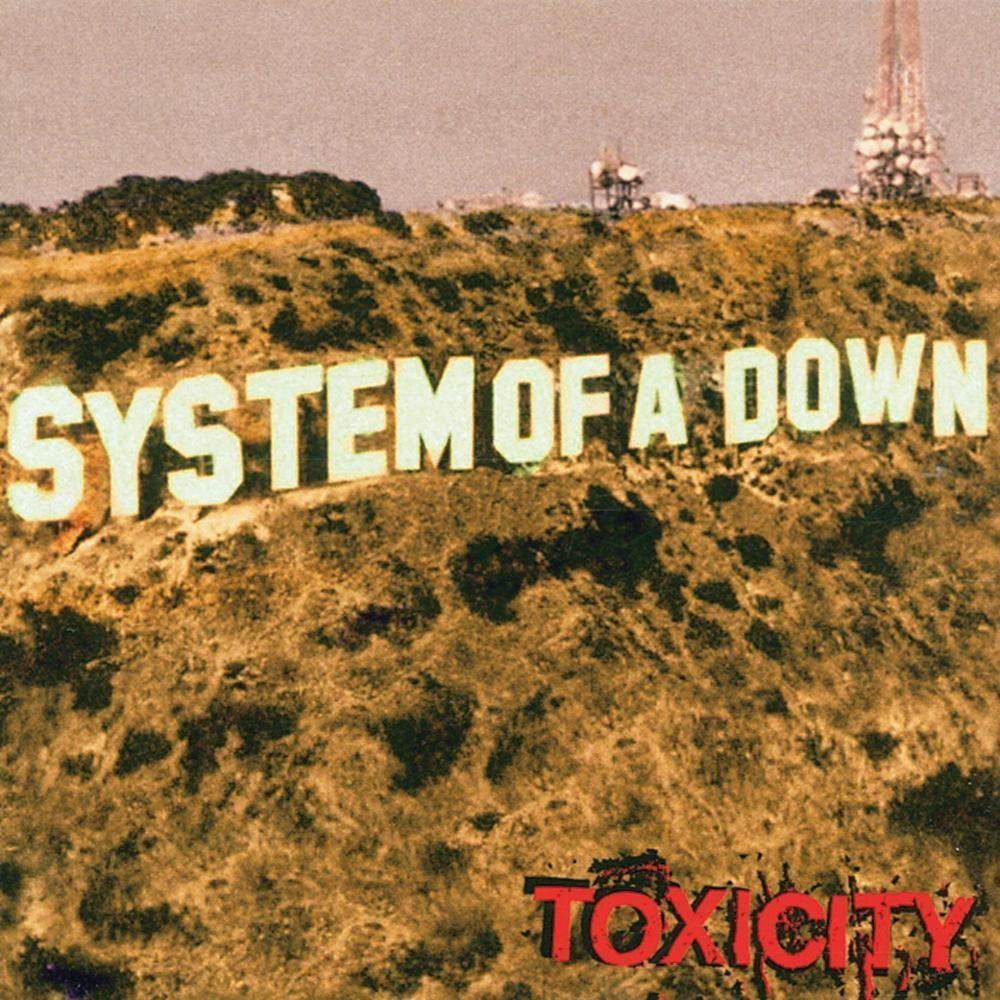

<!DOCTYPE html>
<html lang="en">
<head>
    <meta charset="UTF-8">
    <meta name="viewport" content="width=device-width, initial-scale=1.0">
    <title>Albumes más escuhados de System Of a Down</title>
</head>
<body>
  <main>
      <h1>System of a Down</h1>
      

          <h2>Contexto</h2>
          
Es una banda armenio-estadounidense de heavy metal, formada en 1994 en Glendale, California. Está integrada por el vocalista Serj Tankian, el guitarrista Daron Malakian, el bajista Shavo Odadjian y el baterista
        John Dolmayan.

      

      

          <h2>Stadium tour 2025</h2>
          
Se presentara en distintos países de Latinoámerica, donde muchos de sus fanáticos los esperan con muchas ansías.
 

          <h3>Países de Latinoámerica</h3>

          <ul>
            <li>Colombia</li>
            <li>Perú</li>
            <li>Argentina</li>
            <li>Chile</li>
            <li>Brasil</li>
          </ul>
          
Es por ello que un Top 5 de álbumes, no estaría nada mal para prender motores y estar preparados para ver en vivo a esta gran banda.

         
      

          <h2>Álbumes más escuchados</h2>
          <ol>
              <li><strong>Toxicity</strong></li>
            <li>Hypnotize</li>
            <li>Mezmerize</li>
            <li>Steal This Album!</li>
            <li>Chop Suey!</li>
          </ol>

        
        
        
        
        

          
        <a href="https://www.last.fm/es/music/System+of+a+Down/+albums">
            <h3>Lo más escuchado</h3>
        </a>
    
      

    
  </main>
    
</body>
</html>
